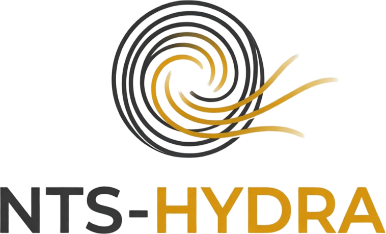

<div align="center">

<picture>
  <source media="(prefers-color-scheme: dark)"
          srcset="assets/nts_hydra_logo_dark.png">
  
</picture>

**Поинтервальный гидравлический расчёт промывки скважины**

[](LICENSE)


[](VALIDATION.md)


</div>

Программа считает гидравлику промывки при бурении по каждому интервалу:
потери давления в наземной обвязке, внутри бурильной колонны, на насадках
долота и в затрубном пространстве. По результатам определяются давление на
насосе, эквивалентная плотность циркуляции, показатели работы долота и
качество очистки ствола. На выходе – оформленный PDF-отчёт.

Исходные данные вводятся в один файл Excel. Программа рассчитана на запуск
из Thonny: открыть `main.py`, нажать F5.

---

## Что умеет

**Реология.** Гершель-Балкли, степенная и Бингама. Модель выбирается по
каждому интервалу; если не указана – определяется по заполненным данным.
Ламинарный режим решается точно, подбором напряжения на стенке под заданный
расход; турбулентный – через обобщённое число Рейнольдса.

**Течение в затрубье.** Модель эквивалентной щели. Учитываются:

- **эксцентриситет колонны** – в наклонном стволе колонна лежит на нижней
  стенке, потери падают до 40 % (Haciislamoglu & Langlinais, 1990;
  Haciislamoglu & Cartalos, 1994);
- **вращение колонны** – добавочный сдвиг снижает вязкость, закрутка потока
  повышает потери;
- **лопастные элементы** – калибраторы и центраторы не перекрывают зазор
  целиком, учитывается проход между лопастями.

**Очистка ствола.** Три режима по зенитному углу: взвесь до 30°, сползающая
подушка 30-55°, неподвижная подушка выше 55°. Высота шламовой подушки
считается из равновесия – подушка нарастает, пока сужение сечения не
разгонит поток до критической скорости. Результат в процентах от диаметра
ствола, а не качественная оценка.

**Прочее.** Окно бурения по поровому давлению и давлению ГРП, плотность
раствора с учётом сжимаемости и нагрева, давление страгивания после
стоянки, восстановление траектории по редким замерам инклинометрии.

**Отчёты.** Полный (конструкция, профиль, разрез, по два разворота на
интервал, сводные результаты) и краткий на две страницы. Языки: русский,
английский, французский.

---

## Быстрый старт

```bash
git clone https://github.com/<аккаунт>/nts-hydra.git
cd nts-hydra
pip install -r requirements.txt
python main.py
```

Без указания файла программа найдёт `.xlsx` в папках `templates/` и
`examples/` и посчитает по нему. Чтобы посчитать свою скважину:

1. Скопируйте `templates/NTS-HYDRA_исходные_данные_ШАБЛОН.xlsx` в рабочую
   папку и заполните. Листы пронумерованы в порядке заполнения.
2. Укажите имя файла в `hydraulics_config.py`:
   ```python
   EXCEL_FILE = "моя_скважина.xlsx"
   ```
3. Запустите `main.py`.

Чего нет – пишите **`н/д`**. Программа возьмёт значение из настроек, посчитает
интервал и отметит, что величина принята условно.

Подробное руководство с иллюстрациями: [`docs/`](docs/).

---

## Проверка расчёта

Два независимых уровня проверки.

**Сверка с промышленным расчётом.** Программа проверена на гидравлических
расчётах из действующей программы бурения: десять режимов, четыре
диаметра ствола, глубины от 772 до 4240 м. Реология, гидравлика долота и
трение в толстостенных трубах совпадают в пределах 3-7 %, эквивалентная
плотность циркуляции в широких стволах – в пределах 0,8 %. Подробно,
включая два объяснённых систематических отклонения, – в
[VALIDATION.md](VALIDATION.md).

```bash
cd validation && python benchmark.py
```

**Проверки расчётного ядра.**

```bash
python tests_validation.py
```

66 проверок расчётного ядра. Тесты проверяют физику, а не совпадение с
прошлым результатом:

- предельные переходы к течению Пуазейля и течению в плоской щели;
- порог страгивания у жидкости с предельным напряжением сдвига;
- сверка с промысловыми формулами в других единицах (psi, gpm, л.с.);
- балансы потерь и непрерывность разбивки ствола;
- монотонность и физичность.

Эти проверки при первом запуске нашли две ошибки: коэффициент ламинарного
трения для трубы вместо коэффициента для щели в затрубье (занижение потерь
на треть) и неверную константу вискозиметра (завышение вязкости на 6,7 %).

---

## Структура

```
main.py                     запуск расчёта
hydraulics_config.py        все настройки
hydraulics_input.py         чтение исходных данных
hydraulics_core.py          общие структуры, траектория, долото
hydraulics_rheology.py      реология и течение
hydraulics_holecleaning.py  вынос шлама и шламовая подушка
hydraulics_solver.py        поинтервальный расчёт
hydraulics_plots.py         графика и сборка PDF
tests_validation.py         проверки расчётного ядра

templates/    шаблоны исходных данных (ru, en, fr)
examples/     заполненный пример и отчёты по нему
docs/         руководство пользователя
tools/        генераторы шаблона и руководства
validation/   сверка с программами бурения
assets/       логотипы
```

---

## Ограничения

Программа считает **установившуюся циркуляцию**. Не моделируются:
свабирование и поршневание при спуско-подъёмных операциях, переходные
процессы при пуске насосов, газопроявления и многофазный поток,
цементирование.

Модель вращения колонны и поправка на лопастные элементы – оценочные,
коэффициенты вынесены в настройки. Критический параметр срыва шламовой
подушки откалиброван так, чтобы в горизонтальном стволе требуемая скорость
отвечала промысловым 0,9-1,2 м/с; зависимость от угла, размера частиц и
плотности породы при этом остаётся физической.

Результат расчёта – инженерная оценка. Решение принимает буровой инженер.

---

## Участие в разработке

Замечания и предложения – через Issues. Перед отправкой Pull Request
запустите `python tests_validation.py`: все проверки должны проходить.
См. [CONTRIBUTING.md](CONTRIBUTING.md).

**Не публикуйте фактические данные по скважинам.** Для примеров используйте
`examples/Пример_исходных_данных.xlsx` – он синтетический.

---

## Язык отчёта

Отчёты и сообщения программы выпускаются на русском, английском или
французском. Язык переключается одной строкой в `hydraulics_config.py`:

```python
LANGUAGE = "ru"   # "en" | "fr"
```

Данные, введённые в исходный файл (названия интервалов, элементов
компоновки, свит), выводятся как есть – они не переводятся.

Шаблон исходных данных выпускается на всех трёх языках – три файла в
папке `templates/`. Пересобрать: `python tools/make_template.py en`.
Программа определяет язык шаблона сама, менять настройки не нужно.

Словари: `hydraulics_lang.py` – строки отчёта, `template_lang.py` –
строки шаблона. Чтобы добавить язык, впишите его код и добавьте перевод
в каждую запись.

Терминология на французском не проверялась носителем языка – замечания
приветствуются.

## Лицензия

[Apache License 2.0](LICENSE) © 2026 Aydar Rakhmatullin

Программа распространяется без каких-либо гарантий. Разрешено свободное
использование, изменение и распространение, в том числе в закрытых
продуктах, при сохранении уведомления об авторстве.

Название NTS-HYDRA и логотип программы – обозначения правообладателя,
лицензия прав на них не даёт (раздел 6). При форке замените их своими.
См. [NOTICE](NOTICE).

---

## English summary

**NTS-HYDRA** – interval-wise drilling hydraulics calculator. Computes
pressure losses (surface lines, drill string, bit nozzles, annulus),
equivalent circulating density, bit hydraulics and hole cleaning for each
drilled interval, and produces a formatted PDF report.

Features Herschel-Bulkley / power-law / Bingham rheology, drill string
eccentricity and rotation corrections, a three-regime cuttings transport
model with equilibrium bed height, drilling window check, and temperature
and pressure effects on mud density. Input is a single Excel workbook.

Interface and reports are in Russian.

Run `python main.py` to calculate and `python tests_validation.py` to
verify the solver (66 physics-based checks). The solver has also been
benchmarked against the hydraulics calculations of an actual drilling
programme – ten operating points, four hole sizes, 772 to 4240 m. See
[VALIDATION.md](VALIDATION.md).

Input templates are provided in Russian, English and French
(`templates/`); the program detects the template language automatically.

Reports are available in Russian, English and French – switch with
`LANGUAGE` in `hydraulics_config.py`. French terminology has not been
reviewed by a native speaker; corrections are welcome.

Licensed under Apache License 2.0.
